单台云服务器通过虚拟化为多个虚拟机（VM）的方式为多个客户提供ECS弹性云服务。有限的云本地盘和云计算资源等物理资源限制了单台机器能够部署的VM数。近年来，计算资源飞速增长。计算资源的复用为单云服务器部署更多VM提供了可能。然而存储发展追不上计算发展！在保持服务水平不变的条件下，现有的云本地盘（HDD，HP-SSD）很难实现部署更多VM（性能和容量两方面）。QLC-SSD凭借其大容量和高性能的优势有望打破这个困局，然而这并没有想象的那么简单直接。经过对I/O的分析，作者提出要解决两个写放大，针对QLC-SSD存储做了相关优化，使其在性能和容量两方面都能达到最优解。

## Background

The *background* is about the following aspects.

- **what field** does the paper focus on?
- What's the **basic knowledge** in this field needed for this work? 

what fields:

cloud local storage

NAND Flash

Caching

什么是云本地盘

basic knowledge:

### **Service Level Object (SLO)**

SLO defines the agreed-upon level of service quality between service providers and customers.

### **Rack Unit**

- A rack unit is often abbreviated as "RU" or just "U", which is the standardized unit of measurement used in server racks, as defined by the Electronic Industries Alliance (EIA). 
- A standard 19-inch rack usually measures 42U height or about 190 centimeters. 
- Most rack-mounted servers come in 1U, 2U, or 4U, so the key is to mix and match form factors that will fully populate the rack while leaving enough room for peripherals such as liquid cooling systems if required. 

The schematic diagram is shown below. 

### **Cloud local disks**

#### **Overview**

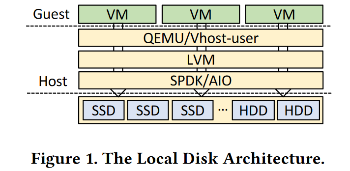

- a mount storage device as a block device
- LVM wraps it as multiple virtual logical devices
- A VM subscribes to some of them as its local disks

> AIO/SPDK can be used to access HDD/NVMe SSD

#### **Resource granularity**

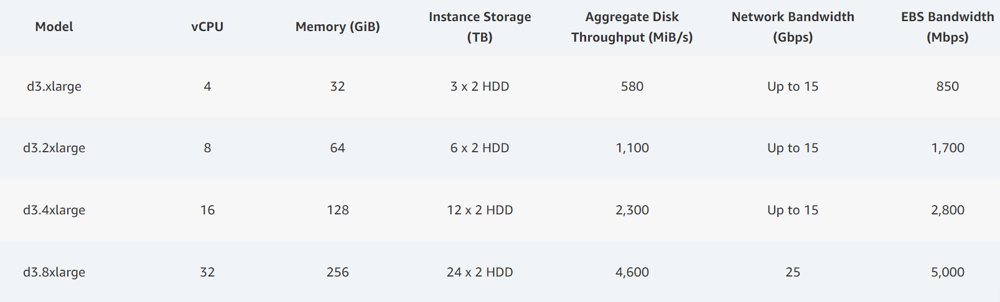

- set a proportion (usually an eighth) of whole physical resources as the finest granularity
- in order to avoid wasting resources led by oversubscribing

#### **Opportunity and Challenges**

opportunity

- in terms of CPU cores and per-core processing power
- multiplex computing resources
- accommodate more instances per server

challenge

- storage needs to consider both capacity and I/O speed simultaneously
- multiplexing storage resources is in challenging and fails to meet SLOs
  - HDDs fail to meet I/O speed SLOs
  - HP-SSDs fail to meet capacity SLOs and higher cost
- Can't simply solve the dilemma by installing more drives

#### **High-density NAND Flash SSD**

- QLC-SSD provide comparable storage space to HDDs while delivering 10x throughput
- QLC-SSD serves as a promising candidate for the local disks
- Two kinds of interface: Generic QLC-SSD and ZNS QLC-SSD

## Motivation

The *motivation* is about the following aspects. Sometimes it can be combined with the *background*.

- what are the **key problems** want to solve in this work?
- what are some **interesting observations** they find?

### **Key problems**

- multiplexing storage resources is challenging and fails to meet SLOs based on HDDs and HP-SSDs
- An intuitive approach: use QLC SSDs as local disks. However, all 3 temps failed to deliver the expected performance.

### **Reason**

Two levels of write amplification, address mapping, and garbage collection

- coarse-grained logical to L2P mapping on QLC (e.g. 64KB) leads to high device-level write amplification
- FTL inside SSD  leads to severe NAND-level write amplification under garbage collections with different data lifespans mixed

### **3 Attempts**

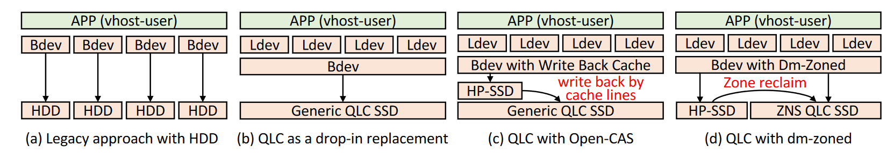

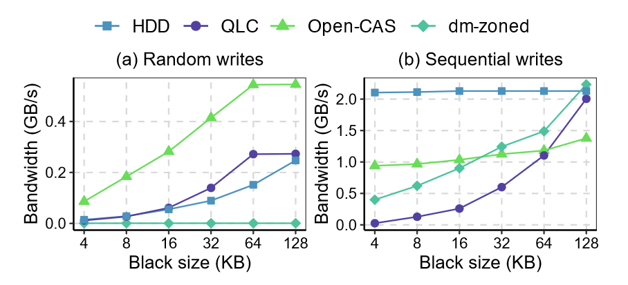

#### **Attempt 1: As a drop-in replacement**

**Method** 

- Use generic QLC SSD as the local disk. 
- In this case, the host can multiplex a large-capacity QLC SSD as multiple logical devices via LVM partitioning.

 **Evaluation**

- In sequential writes, while HDDs maintain a constant throughput, QLC delivers rather subpar performance.

**Analysis**

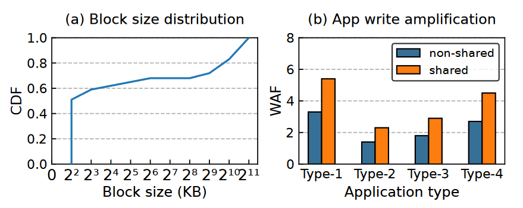

- QLC NAND, the superblock of which becomes much larger. (e.g., 67.4GB in Intel P5316)
- Small block writes account for more than 60% in local disk in Alibaba Cloud local disks.
- Under the scene of deploying different typical apps on non-shared TLC-based SSD, the average WAF is 2.3. However, under the scene of deploying them on shared QLC-based SSD, the average WAF is 3.8.
- **This will lead to**: 
  - The different write patterns of apps would cause data with different lifespans (from different users) to be stored in the same erase block.
  - The frequent small writes lead to a significant increase in NAND-level write amplification triggered by garbage collection. 

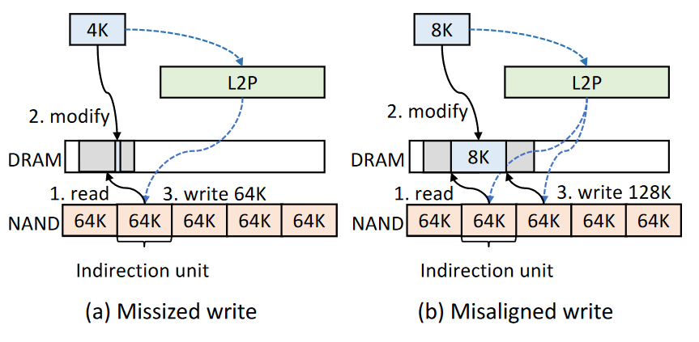

- Current QLC-based SSDs set a larger indirection unit size (e.g., 64KB in Intel P5316) to shrink the mapping table. However, the page size in operating system is 4KB.
- **This will lead to:** 
  - After updating the 4KB, the SSD controller then flushed the whole 64KB back to the NAND flash, causing a 16x device-level amplification.

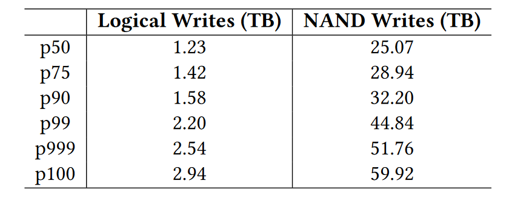

- QLC-SSDs (e.g.,  Intel P5316) offer a 5-year 1.83 Drive Writes (i.e., 15.36TB) Per Day warranty under the optimized writes (i.e., the WAF is 1).
- In the rightmost column of table above, they calculate the actual daily NAND writes after calibration the WAF and the real data block size distribution in figure above.
- This will lead to: 
  - In order to satisfy 99.9% of tenants, the QLC SSD has to endure 51.78TB NAND write per day if they directly employ QLC SSDs.

#### **Attempt 2: Write-Back Cache**

**Method**

- use HP-SSD as a write-back to absorb the small writes
- use open-CAS to build LRU-based cache (granularity of 64KB to align with the unit of 64KB on QLC SSD)

**Evaluation**

- regarding sequential writes, while the performance improves (compared to the single QLC), but it still lags behind the HDD.

**Analysis**

- It periodically flush the cache, thereby incurring considerable device-level write amplification and performance loss.

#### **Attempt 3: As a drop-in replacement**

**Method**

- Use ZNS QLC SSD as a series of sequential zones in the place of Generic QLC SSD
- Use HP-SSD as a series of random zones
- use dm-zoned to achieve the above methods
- all sequential writes will route to sequential zones, while random writes will first route to sequential zones and then are migrated to the sequential zones.

**Evaluation**

- It can't support the random writes
- In case of sequential writes, dm-zoned solution is always faster than the Generic QLC SSD.
- It delivers lower throughput on 4-16KB writes, the same throughput on 32KB writes, and higher throughput on 64-128KB writes. 

**Analysis**

- small sequential writes are merged in HP-SSD, while the large writes are delivered to the ZNS QLC SSD
- the random zones on HP-SSD would soon run out with random writes and need to be migrated to the ZNS QLC SSD
- one-for-one policy need to pad zones with zero, wasting most of the space and resulting in huge performance loss with being busy with migrating data.

### Key insight

Lesson learned from the 3 preliminary failed attempts:

- **2 levels of write amplification** (NAND level, device level) is critical for the performance and the endurance based on QLC SSD.
- ZNS-based solution **failed on random writes** with severe performance penalties due to larger granularity of address management.
- ZNS interface allows the host to perform **workload-aware allocation** with separating hot/cold data in order to alleviate the NAND-level write amplification 

## Design

### **Core idea & Core technical point**

- **device-level WAF & Failure on Random Writes**: using a page table to achieve fine-grained (4KB) L2P address translation. Two-level L2P mapping is used to achieve fine-grained data access and thus alleviate device-level write amplification.
  > hold the top-level in host DRAM, swap parts of the second-level between DRAM and HP-SSD 
  >
  > **THINK:** why does it use the two-level table? to shrink the L2P table

- **NAND-level WAF & ZNS opportunity**: using a HP-SSD as a log-structured write buffer. Periodical compaction that reclaims write buffer space by aggregating cold data as large sequential writes to ZNS QLC SSD.
  > route all writes (random &sequential) to HP-SSD as append-only writes and then periodically aggregate and flush the data to zones in ZNS QLC SSD with workload-aware compaction
  >
  > the aggregation is by users

### **Core benefits**

- two-level 4KB granularity mapping alleviates the device-level write amplification
- data group with similar lifespans reducing the NAND-level write amplification

### **Hybrid architecture**

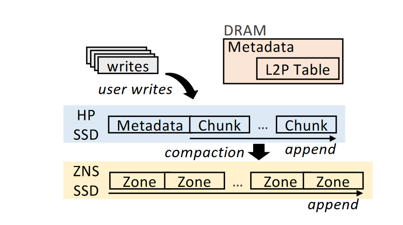

CSAL uses the storage architecture with 3 levels:

- use around 3GB (by default) **DRAM** for in-memory data structure. The **DRAM** holds the L2P table, including the top level and a part of the second level (about 32MB). Besides, DRAM holds recently accessed pages (about 2GB).
- use around 730GB **HP-SSD** as write buffers. The HP-SSD stores the **entire two-level L2P tables** and the **write buffer**. The write buffer is organized as several log-structure **chunks**. Chunk: multiple (4KB segment and its 64B padding)
- use around 15.36TB  **ZNS QLC SSD** for performance. The ZNS QLC SSD stores **the compaction data**, which is composed of multiple fixed-size append-only **zones** (same format as the chunk). **Zone:** multiple (4KB segment and its 64B padding)

### **Write Procedures**

The write procedures of CSAL include the following 3 parts.

- **User Write**. CSAL **1. packs** the data as a series of units (4KB data segment and 64B metadata padding), **2. updates** the L2P table and **3. returns success**.
- **Data Compaction**. CSAL **1. groups** and **1. merges** valid data segments by users (workload information), then **2. flushes** them to the corresponding zones on ZNS QLC SSD as large sequential writes (128KB), at last **3. updates** the L2P tables.
- **Garbage Collection**. CASL **1. performs GC** and **2. updates** the L2P tables.

### **Key challenge**

- crash consistency: a LBA address may be touched by above 3 write procedures.

###  **Data structures & layout**

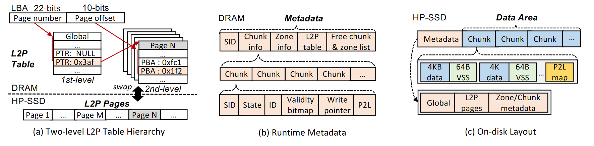

- **L2P table**. In 16TB SSD, both LBA and PPA are 32 bits. A DRAM/HP-SSD page is 4KB with 1K entries (4B each). The top-level table is 4MB, and the second-level table is 16GB.
- **DRAM layout**. It includes SID, chunk/zone info, L2P table, and free chunk/zone list. 
  - **SID**. unique identifier, be increased by one and assigned when a chunk/zone open, be used to solve LBA conflicts.
  - **chunk/zone info**. SID, state, id, validity bitmap, write pointer, P2L of open chunk/zone (P2L be flushed to SSD when chunk/zone is closed).
- **HP-SSD/ZNS QLC SSD layout**.
  - **metadata region**. The persistence of SID, L2P table, and chunk/zone info. Only the HP-SSD has the metadata region. The ZNS QLC SSD doesn't have the metadata region with a single data region.
  - **data region**. It is organized as a series of chunks/zones.  Chunk and zone are in the same size (1GB) and both append-only except chunks are in the HP-SSD and the zones are in ZNS QLC SSD. The HP-SSD only opens a chunk (to receive incoming writes), but the ZNS QLC SSD opens 2 zones (one for compaction and the other for garbage collection). Both chunks and zones are organized with multiple sets of 4KB segment and its 64B padding. The P2L map is stored with the 4KB pages of the chunks.

### **Control & Data flows**

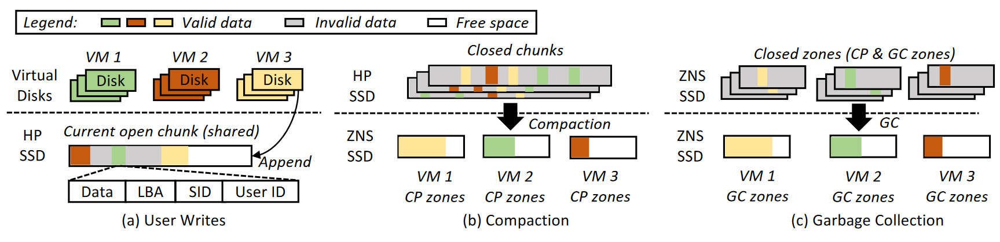

- **read.** read is straightforward with **1. searching** the actual PBA by the 2-level table (I/O on DRAM and HP-SSD) and **2. issuing** the PBA to the device (HP-SSD or QLC-SSD).

  >Best: DRAM + HP-SSD
  >
  > Worst: DRAM + HP-SSD + QLC-SSD

- **write.** 
  - **user writes.** CSAL **1. appends** the incoming writes to the currently opened chunk in HP-SSD as a series of sets of (4KB data page and 64B metadata padding). The metadata includes a SID, LBA, and UID. HP-SSD share the same cache space for different users, therefore CSAL **1. tags** their data with a unique UID. Then CSAL **2. updates** the L2P table and the validity bitmap by locating the L2P entries, altering the new <LBA, PBA> in the L2P table, and marking the previous LBAs invalid and the latest LBA as valid.  
  - **data compaction.** The capacity of HP-SSD is limited, so CSAL needs to evict the chunks to ZNS QLC SSD (when free chunks are less than the threshold of 20% by default). CSAL **1. chooses** the chunk with the lowest valid block ratio and **1. reads** valid blocks and their UID. Then CSAL **1. aggregates** data into DRAM buffer **1. grouped** by UID.  Then CSAL **3. batches** data appending into per-user zones (when the buffer reaches 512KB) and frees the selected chunk when all are done. At last, CSAL **3. updates** the L2P table the same as the user writes. CSAL iterates this process until the number of free chunks is larger than or equal to the threshold.
  -  **garbage collection**. ZNS QLC SSD demands garbage collection to reclaim the stale data. CSAL reserves 10% space and performs garbage collection when there are less than 5 free zones. CSAL  **1. chooses** the chunk with the lowest valid block ratio and **2. isolates** the garbage collection and compaction in order not to mix the different lifespans data of different users

With 3 types of write streams above, the different kinds of user data are placed in three layers. The frequently updated data (short lifespan) is stored in HP-SSD and the rarely updated data (long lifespans) is stored in ZNS QLC SSD. And the different lifespans data of users are physically isolated in different zones.

### **Crash and Concurrency Consistency**

- **Naive solution.** CSAL rebuilds the L2P mapping by scanning the data regions on HP-SSD and ZNS QLC SSD, then marks the free zones and rebuilds the validity bitmaps. Regarding to  the LBA conflict, CSAL trusts the data block with the highest SID.  When the SIDs of data pages are the same (in the same chunk), CSAL trusts the data block with the highest address.

- **P2L table**. A whole address (16TB) scanning requires **an hour** under a 6GB/s sequential read throughput. Using the P2L table only need to scan the tail of each zone/chunk (P2L table, 32GB) and three open chunks/zones (open chunk, two open zones for compaction and GC, around 3GB).
- **checkpoint.** CSAL keeps track of the complete two-level L2P table. CSAL uses checkpoints and the clean flag to leverage the persisted L2P table to accelerate restoring. The checkpoint is a SID, indicating that all the L2P entries before this SID are persisted and CSAL only needs to check the entries with the higher ones. With a checkpoint per 1TB writes, CSAL only has to read the L2P table (16GB), the P2L table (only 1GB), and three open chunks/zones (3GB). The checkpoint and P2L table optimization only require around **5 seconds**.

**Implementation**

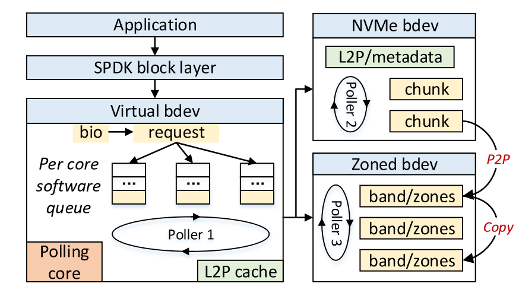

- Via SPDK, CSAL registers a virtual block device to the SPDK block layer.
- CSAL creates multiple I/O queues and I/Os from different threads (users) are dispatched to different I/O queues.
- CSAL register 3 pollers in its thread for I/O processing of client (user writes), compaction, and GC tasks.

## Evaluation

The *Evaluation* is about the following aspects.

- What are the **advantages** of the methods shown in all-around evaluation?
- what are the **limitations** of the methods shown in all-around evaluation?

**Evaluations:** micro, application, deployment benchmark

**Result:** 2.22x, 1.82x, 2.03x speedups 

## Conclusion

### **The disadvantages**

- Some details about SSDs make me confused without a convincing description even if I'm familiar with SSDs
- The point of innovation is a bit engineering. I find it hard to summarize the core idea and the key insight through the design.
- Some details about writing make me confused too, as shown in the following pictures

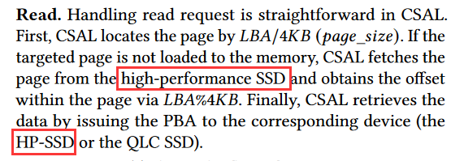

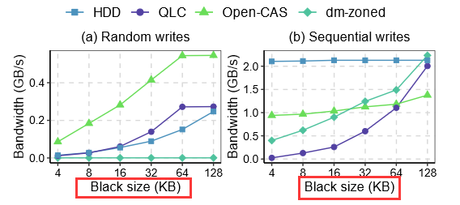

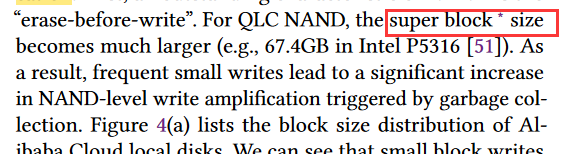

- Some technical points, such as SID to solve the LBA conflicts, are simple. And the technical points, such as the P2L table, are widely used. The key challenge is not so important for the core idea and simple to handle too, to solve which they just use SID, P2L table, and checkpoints. 
- About the price.
- Some methods , such as about the dm-zoned, is unclear.
- The work is excellent, but this paper can't convey the fact to the readers effectively with fragmented information. I need to think and summary the innovation point carefully by myself.

### **The Question**
- why does the f2fs not work?->local disk, instead of file manager
- what's the difference between the 4kb general qlc ssd and csal? maybe it's impossible to take 4kb in qlc ssd and it will have a nand-level amplification.

#### **What can I learn**
- New to learn about the storage problem in cloud servers, such as the constraint of a 2U rack unit, the multiplex of resources, and the dilemma of achieving both large capacity and high I/O performance.
- The **writing methods** of using several progressive failed temps and lessons learned as motivation and observation. 
- **The granularity mismatch** between QLC SSD's 64KB large pages and OS's 4KB small pages, which has not been previously addressed. 
- **The fact that ZNS SSDs don't have FTL is not true.** ZNS SSDs also can use FTL to locate the PBA for random reads. And the LBAs of a zone do not have to increase continuously. 
- My work on in-place updates also contains the LBA conflicts. I can learn about the writing of LBA conflicts.  
- get to know some tests on SSDs, such as skewed writes and Zipf，4KB/64KB writes, evaluating different features.
- The command of block storage in the actual production environment.
- **Pure storage problem but be packed in a cloud topic/story**. 
- How the host use the ZNS, i.e., how does the perspective of host on ZNS look like?
	- **abstract to file.** log-structure filesystem. manage all the data and file by using the device with eliminating the random writes.
	- **abstract to block layer.** FTL on Host. It delivers the opportunity of random writes.

### Future work
- [x] code is in SPDK
- [x] the hybrid design is simple, look for more design points
- [x] the classification only uses the UID of different VM, how to improve it?

## More Read

The key strategy of CSAL is to leverage an SCM SSD as the cache to **compact and shape user random writes** to SSD-friendly writes.

CSAL uses an ultra-fast write buffer (SCM) to 1.**aggregate and sequentlize** the small random I/O (4KB) to larger one (128KB) and 2. use as the data buffer for **data classification**.
in order to 1. match the ZNS interface, and 2. reduce the NAND-level amplification.

CSAL implements a caching and translation layer that transforms zoned storage to conventional storage.

CSAL uses a conventional (high-performance) block device for metadata and writes sequentially to the ZNS SSDs, thus hiding ZNS SSDs, thus hiding ZNS sequential write constraint.

You can't get more performance by only adding the capacity.

multi-tenancy QoS software enables 8x drive density and resulting in a 3x rack saving.

本地盘是ECS实例所在物理机上的本地硬盘设备，为ECS实例提供本地存储访问能力。由于本地盘直接连接到物理机上，因此它具有低时延、高随机IOPS、高吞吐量和高性价比的优势。这使得本地盘非常适合需要高性能存储的应用场景，比如需要大量随机访问的数据库和缓存系统等。

use ZNS benefits:
- No on-SSD DRAM
- No PLI (capacitor, SRAM)
- Zero OP

## Reference

1. <a href="https://www.solidigm.com/support-page/drivers-downloads/ka-01786.html"> Cloud Storage Acceleration Layer (CSAL) Introduction | Solidigm</a>
2. <a href="https://github.com/spdk/spdk/tree/master/lib/ftl">CSAL Code | Github SPDK</a>
3. <a href="https://spdk.io/doc/ftl.html">CSAL Introduction | SPDK docs</a>
4. <a href="https://www.solidigmtechnology.com/products/technology/cloud-storage-acceleration-layer-write-shaping-csal.html"> Advantages of Cloud Storage Acceleration Layer (CSAL) | Solidigm</a>
5. <a href="https://www.sniadeveloper.org/events/agenda/session/633"> New Developments in Cloud Storage Acceleration Layer (CSAL), an FTL in SPDK | SDC23</a>
6. <a href="https://www.snia.org/educational-library/cloud-storage-acceleration-layer-csal-enabling-unprecedented-performance-and"> Cloud Storage Acceleration Layer (CSAL): Enabling Unprecedented Performance and Capacity Values with Optane and QLC Flash | SDC22</a>
7. <a href="https://blog.csdn.net/qq_36159989/article/details/140263607"> CSAL: the Next-Gen Local Disks for the Cloud——论文泛读 </a>
8. <a href="https://mp.weixin.qq.com/s/lh8nRH9BnS_Ouf2N0y-JwA"> CSAL：QLC SSD替换HDD...有什么问题？ </a>
9. <a href="https://aws.amazon.com/ec2/instance-types/d3/"> Amazon EC2 D3 & D3en Instances </a>
10. <a href="https://www.gigabyte.com/Glossary/rack-unit"> Rack Unit (GIGABYTE) </a>
11. <a href="https://mp.weixin.qq.com/s/srail12y8VlojgXa1bSmkw"> WD：加速云原生 Zoned Storage </a>
12. <a  href="https://help.aliyun.com/zh/ecs/user-guide/big-data-instance-families"> 阿里云存储实例规格(d2c, d3c等)  </a>
13. <a  href="https://help.aliyun.com/zh/ecs/user-guide/elastic-block-storage-devices"> 阿里云块存储概述</a>
	1. <a href="https://help.aliyun.com/zh/ecs/user-guide/block-storage-performance?spm=a2c4g.11186623.0.0.2b8c9fbbj7Zscf"> 块存储性能（云盘，本地盘） </a>
	2. <a href="https://help.aliyun.com/zh/ecs/user-guide/essds?spm=a2c4g.11186623.0.0.1b3647a2u2QnAJ">ESSD云盘</a>
	3. <a href="https://help.aliyun.com/zh/ecs/user-guide/local-disks?spm=a2c4g.11186623.0.0.2b8c9fbbj7Zscf">本地盘</a>